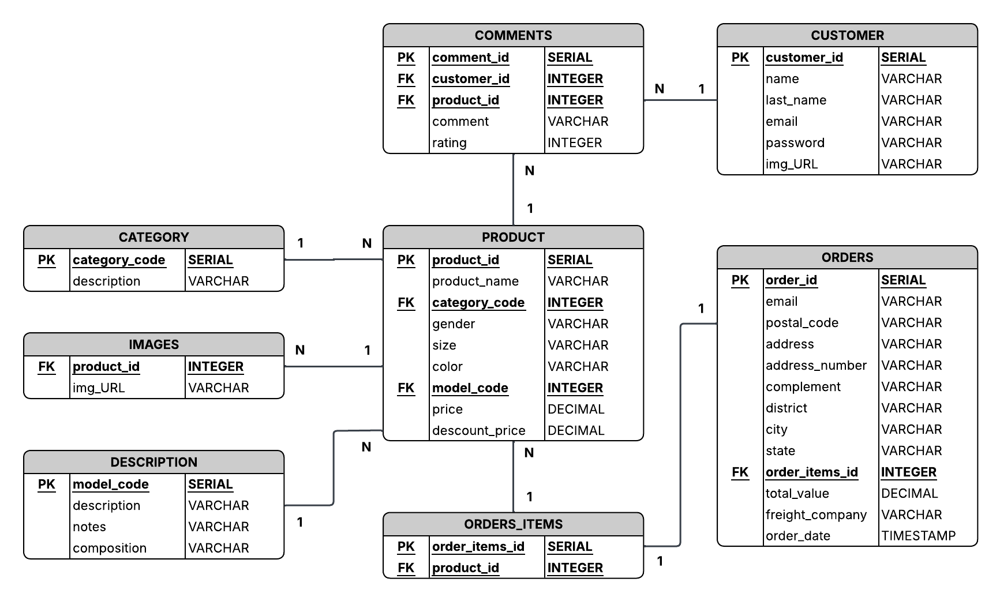
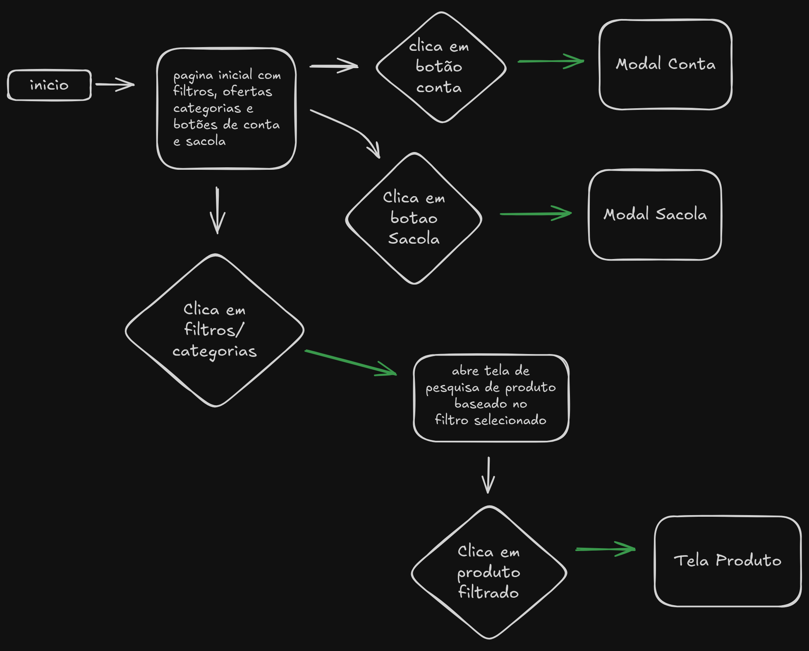
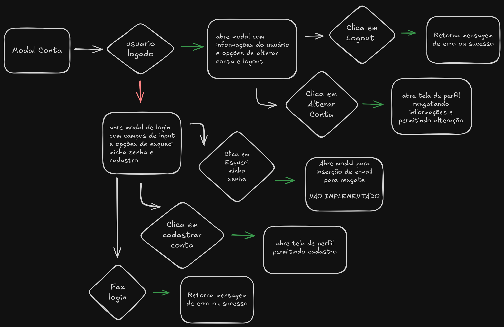
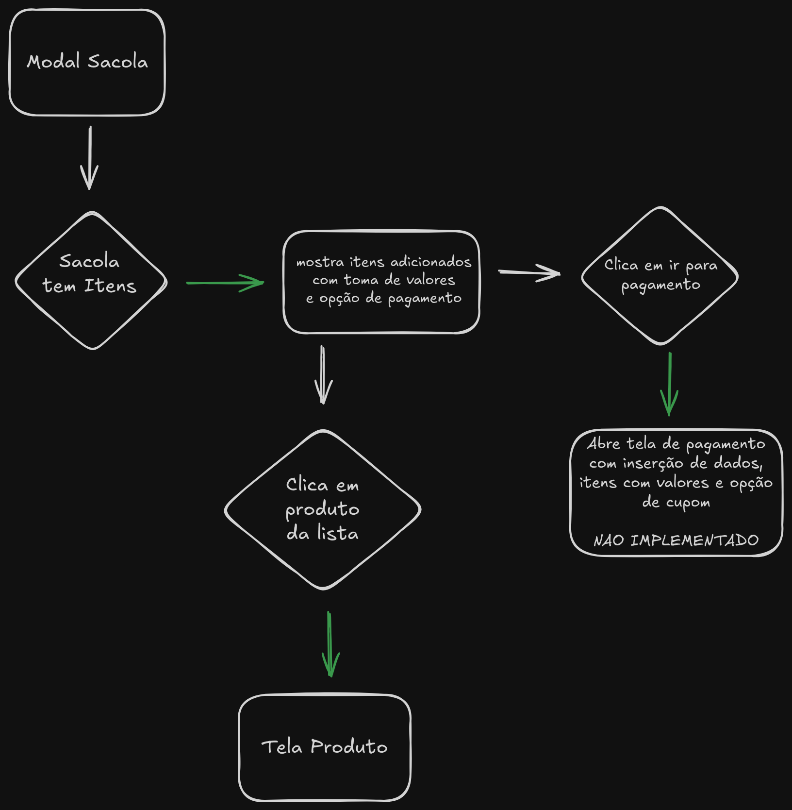
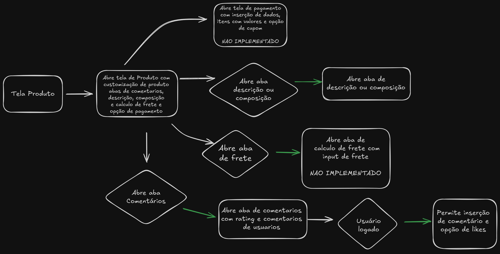

## SUMÁRIO

- [Sobre](#sobre-o-site)  
- [Linguagens e Aplicações](#linguagens-e-aplicações-utilizadas)  
- [Fluxograma](#fluxograma-de-navegação-pelo-site)  
- [Requisitos](#requisitos-do-sistema)  

****

## SOBRE O SITE
 Serviço Fullstack de uma loja virtual de roupas urbanas.
 - Serviço focado em pessoas interessadas em roupas de estilo urbano de todos os generos e idades.
 - Como um serviço focado em estudo das tecnologias aplicadas, ele não será hospedado.
 - Esse serviço possue 5 telas (inicial, produto, perfil, pagamento e pesquisa), uso de modais e carrosel de produtos, sendo exclusivamente uma aplicação web com versões desktop e mobile.
   Para visualização do design acesse o link do [Design do Projeto no Figma](https://www.figma.com/design/UYhSxr5YA4a3qpLkndqpIy/Urban_Soul?node-id=0-1&t=5fhOM2augt4dKMt3-1)
   
****

## LINGUAGENS E APLICAÇÕES UTILIZADAS
 Esse serviço é focado na simplicidade e estudo, onde:
 - Para a [aplicação frontend](https://github.com/oibene/urbansoul-app) é usada a framework Reactjs.
 - Para a [API backend](https://github.com/oibene/urbansoul-API) é usado a arquitetura REST com a linguagem GO.

 - Para a persistencia de dados é usado o banco PostegreSQL com a modelagem de dados abaixo
  
 
****

## FLUXOGRAMA DE NAVEGAÇÃO PELO SITE

 - O visitante ao entrar no site receberá ofertas de produtos, opções de filtros e categorias, assim como icones de visualização. O sistema é ilustrado abaixo.
   

 - Caso o visitante possua uma conta ou queira abrir uma, ele poderá clicar no icone de conta e ser redirecionado a opção mais adequada, sendo login, alteração, recuperação ou cadastro de sua conta.
    

 - Caso possua itens em sua sacola será permitido a visualização desses itens. Tambem é disponibilizado a opção de ir para a tela de pagamento (que possivelmente terá será implementado em uma V2)
    

 - Ao acessar a tela de pesquisa ao clicar em uma categoria e selecionar um produto ou selecionar produto na sacola é aberto a tela de produto.
 - Essa tela permite a customização do produto de maneira especifica e abas para melhor visualização do produto, como comentarios e descrição.
    
     
****

## REQUISITOS DO SISTEMA
 Por se tratar de um sistema desenvolvido para estudo, é uma boa pratica mapear os requisitos funcionais e nao funcionais do sistema para melhor controle. Eles são:

 REQUISITOS FUNCIONAIS
 - Usuário poderá criar ou alterar sua conta e logar-se;
 - Usuário poderá comentar e avaliar o produto;
 - Não será necessário o uso de conta para compras no site;
 - Usuário poderá pesquisar o produto desejado;
 - Filtros devem levar a tela de pesquisa tais como categorias selecionadas;
 - Produtos nao encontrados devem retornar uma tela de erro;
 - Usuarios já cadastrados receberam tela de aviso antes de criar sua conta.

 REQUESITOS NAO FUNCIONAIS
 - Tela poderá enviar um e-mail ou whatsapp da sua nota fiscal para usuário ao "concluir pagamento";
 - Sistema de resgate de conta envia confirmação por e-mail ou whatsapp para redefinição de conta;
 - Sistema de 2 etapas por e-mail ou whatsapp;
 - Telas que durem mais de 2 segundos deveram possuir tela de carregamento.
   
****
